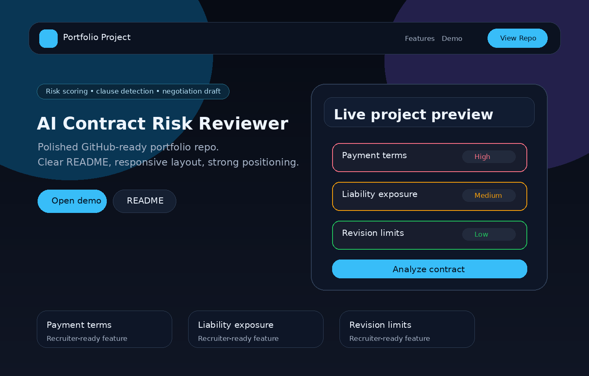

# 🤖 AI Contract Risk Reviewer

> An AI-powered contract analysis tool that detects risk clauses, scores contract safety, and generates negotiation-ready recommendations — built with a real Node.js backend and OpenAI API integration.

🔗 **[Live Demo](https://fullstackwithai.github.io/ai-contract-risk-reviewer/)** &nbsp;|&nbsp; 👤 *[Portfolio](https://www.designhubmk.com)* &nbsp;|&nbsp; 💼 **[LinkedIn](https://www.linkedin.com/in/arsim-shefkiu-78432a3b5)**

---

---

## 🧠 What This Project Demonstrates

This is a full-stack AI product — not just a UI mockup:

- *Real backend* — Node.js + Express server with an /api/analyze-contract endpoint
- *OpenAI API integration* — wired and ready for live AI contract analysis
- *Prompt engineering* — structured prompts for clause detection, risk scoring, and negotiation output
- *SaaS product thinking* — polished interface designed like a real LegalTech product
- *End-to-end architecture* — frontend ↔️ API ↔️ AI model flow fully designed

---

## ✅ Features

- *Contract Text Input* — Paste any contract text for instant analysis
- *Risk Severity Cards* — High / Medium / Low risk clauses clearly flagged
- *Contract Safety Score* — Numeric risk score with visual indicator
- *Negotiation Email Draft* — AI-generated counter-proposal language
- *Local Demo Mode* — Works without an API key for instant portfolio preview
- *OpenAI-Ready Backend* — Full server route ready for live AI responses
- *Mobile-Friendly SaaS UI* — Clean, professional interface across all devices

---

## 🛠️ Tech Stack

| Layer | Technology |
|---|---|
| Frontend | HTML5, CSS3, Vanilla JavaScript |
| Backend | Node.js, Express |
| AI Integration | OpenAI API (/api/analyze-contract) |
| Deployment | GitHub Pages (frontend) |

---

## 🚀 Run Locally

*Frontend only (demo mode):*
bash
open index.html
# or
npx http-server .

*Full stack with AI backend:*
bash
npm install
OPENAI_API_KEY=your_key_here npm start

Then POST contract text to:

http://localhost:3000/api/analyze-contract

---

## 📁 Project Structure

ai-contract-risk-reviewer/
├── index.html        # Frontend SaaS UI
├── server.js         # Node.js + Express backend
├── package.json      # Dependencies
├── assets/
│   └── screenshot.png
└── README.md

---

## 🔮 Planned Improvements

- [ ] Connect frontend to live backend endpoint
- [ ] PDF upload and parsing
- [ ] Jurisdiction selector (US, UK, EU)
- [ ] Saved review history with authentication
- [ ] Multi-clause comparison mode

---

## 👤 About

Built by *Arsim Shefkiu* — Full Stack Web Developer & AI-Assisted Builder specializing in AI-powered web products.

- 🌐 [designhubmk.com](https://www.designhubmk.com)
- 📧 info@designhubmk.com
- 💼 [LinkedIn](https://www.linkedin.com/in/arsim-shefkiu-78432a3b5)
- 🐙 [GitHub](https://github.com/fullstackwithai)
-
